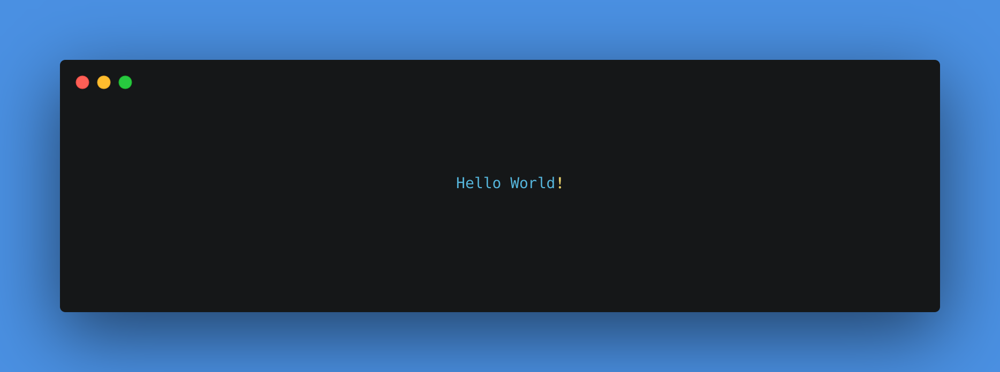

# Hey there :wave:

<!--  -->

<!-- ## About me
 -->
I'm Triarta. A Student at [Ganesha University of Education](https://undiksha.ac.id) and also Beginner Web Developer base on Bali. :tea: lover. 
<!--

- 🌱 I’m currently learning React and Flutter

## 🧰 Languages and Tools:

 -->
<!--

-->
<!--  -->
<!--

-->
<!--  -->
<!--

  

-->
<!-- 

 -->
<!--
## Get in touch :tea:

- Your future buddy to discuss Android related things and tech in general on [Twitter](https://twitter.com/viradiya_sagar).
- Your future life savior :stuck_out_tongue: on [Medium](https://medium.com/@sagarviradiya).
- Your future employee on [LinkedIn](https://www.linkedin.com/in/sagarviradiya)
- And of course GitHub you're already on (Recursion).
-->

<!--

Here are some ideas to get you started:

- 🔭 I’m currently working on ...
- 🌱 I’m currently learning ...
- 👯 I’m looking to collaborate on ...
- 🤔 I’m looking for help with ...
- 💬 Ask me about ...
- 📫 How to reach me: ...
- 😄 Pronouns: ...
- ⚡ Fun fact: ...
-->
